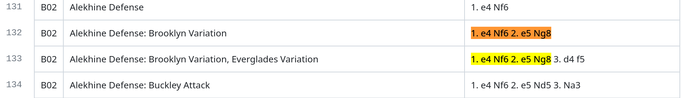

# eco.json
version 3.9.0

<span style="color: powderblue">A compendium of over 12k known opening variations.</span> See [References](#references) at the bottom of this page.

#### Changes:
Fixed conflicting isEcoRoot entries; add missing B33 ECO variation

## The files

There is a JSON file for each of the ECO categories A, B, C, D, & E; e.g. <span style="color:orange">ecoB.json</span>. 

The lichess database (eco_tsv) is the authoritive database, which [supplants](https://www.google.com/search?q=supplants) conflicts with all other databases listed above (such as move order or name).

### Example JSON-encoded opening
```
{
  "rnbqkb1r/pppppppp/8/3nP3/3P4/8/PPP2PPP/RNBQKBNR b KQkq": {
    "src": "eco_tsv",
    "eco": "B03",
    "moves": "1. e4 Nf6 2. e5 Nd5 3. d4",
    "name": "Alekhine Defense",
    "aliases": {
      "eco_js": "Alekhine Defense, 2. e5 Nd5 3. d4",
      "scid": "Alekhine: 3.d4"
    },
    "scid": "B03a"
    "isEcoRoot": true
  },
  ...
}
```

<span style="color:red">__fen__</span>
>The Forsyth-Edwards Notation of the position on the board after all opening moves are played. A FEN string __*uniquely identifies each opening*__, and thus FENs are the JSON object keys.

<span style="color:red">__src__</span>
> Identifies the source of the opening data; normally this will be __eco_tsv__, but could be __eco_js__ or __scid__ if no __eco_tsv__ opening corresponds to the fen.

<span style="color:red">__eco__</span>
> The ECO code of the opening; multiple openings can share the same ECO (it is a category, not an identifier)

<span style="color:red">__moves__</span>
> The "standard" move sequence of the opening. Some openings can be arrived at by transposition, so opening moves are not identifiers.

<span style="color:red">__name__</span>
> The common English name of an opening. Origin of the name is determined by __src__, but there can be aliases from other sources

<span style="color:red">__aliases__</span>
> These are variations of what the opening is called. For example, the __Ruy Lopez__ opening is sometimes called the __Spanish Opening__, depending on source

<span style="color:red">__scid__</span>
> since SCID codes extend ECO codes, this will be included where applicable

<span style="color:red">__isEcoRoot__</span>
> If true, this variation's moves appear in the Encyclopedia of Chess Openings as the root variation for the <span style="color:red">__eco__</span> code, above

# eco_interpolated
In __eco.json__ there are ~2000 "orphan" variations. An orphan variation has no `from` field, indicating that there is no preceding _named_ variation. There are moves that precede the last move of the orphan variation (unless it's a first move, of course). Opening records can be created for these prededing move sequences, which fill in the gaps in the eco.json data structure.

Let's take a look at one case. [One of the opening books](https://github.com/lichess-org/chess-openings/blob/master/b.tsv) at [__eco_tsv__]((https://github.com/niklasf/eco)) contains these four variations of the Alekhine Defense:



There are two entries for the Brooklyn Variation of the Alekhine Defense on lines 132 and 133. However, there is no named variation for the move sequence __1. e4 Nf6 2. e5 Ng8 3. d4__. This makes the variation on line 133 "orphaned", in that it has no preceding named variation that leads to it.

## the eco_interpolated.json file
Every orphan variation (like the <span style = "color:blue">Alekhine Defense: Brooklyn Variation, Everglades Variation</span>) has a move sequence. By moving backwards from the end of the move sequence, we eventually wind up at a named variation, which is called the __root__ variation. Along the way, a record of each FEN position and remaining moves in the sequence is made. Then, from the root to the orphan, are created __interpolated__ opening objects that bridge the gap between root and orphan.

A more detailed explanation can be found in Part 2 of [this blog post](https://medium.com/@jefflowery/navigating-chess-openings-part-1-8d779aee0965).

### naming the interpolated variations
Interpolated opening variations _may_ have a name, but just weren't found in our sources. This can be corrected over time, and freshly named interpolated openings can be inserted into the __eco.json__ file as they are discovered. In the meantime, the names assigned to interpolated openings are the root name plus `" (i)"`. There may be several of these, but openings names are not required to be unique (only FENs are).

For the example above, the interpolated opening object would be:

```
{
  ...
  {
    "rnbqkbnr/pppppppp/8/4P3/3P4/8/PPP2PPP/RNBQKBNR b KQkq - 0 3": {
      "src": "interpolated",
      "eco": "B02",
      "moves": "1. e4 Nf6 2. e5 Ng8 3. d4",
      "name": "Alekhine Defense: Brooklyn Variation (i)",
      "scid": "B02l",
      "aliases": {
        "scid": "Alekhine: Brooklyn Defence (Retreat Variation)"
      }
  },
  ...
}
```
Note that __src__ is labeled "interpolated", meaning it wasn't derived directly from either of the originating three sources: __eco_tsv__, __eco_js__, or __scid__.

### additional interpolations
It is often desirable to have every move subsequence that appears within an opening to have an entry in the database as well. For example, the move sequence for the "Queen's Gambit Declined: Exchange Variation" is "1. d4 Nf6 2. c4 e6 3. Nc3 d5 4. cxd5"; however there is no opening book entry for the subsequence "1. d4 Nf6 2. c4 e6 3. Nc3 d5". This leaves a gap between "1. d4 Nf6 2. c4 e6 3. Nc3" ("Queen's Pawn: Neo-Indian") and the current variation. To fix this, an interpolation is created for the missing subsequence, "Queen's Pawn: Neo-Indian (i)".


### using interpolated openings
It's a simple matter to merge eco_interpolated.json with eco.json, once the two files are read into a program as JSON objects. See `/tooling/ecoConjoined.mjs` for how to do this.

# fromTo.json
One or more move sequences can lead to every opening position in eco*.json. Obversely, zero or more opening continuations are available from any opening in eco*.json. The data file `fromTo.json` is an array of arrays holding this information. Each element of the fromTo array is as follows:
1. __from__ position (FEN notation)
2. __to__ position
3. __from__ source (see list at top of page; may include "interpolated")
4. __to__ source


# The /tooling folder
*NOTE*: It is recommended to use the [eco.json.tooling](https://github.com/JeffML/eco.json.tooling) project to generate pull request opening data. The files in this project's current /tooling folder will be incorporated there soon, making this a data-only project once again.

The <span style="color:orange">/tooling</span> folder has scripts for manipulating the data in the JSON files. They have a node.js-compatible ".mjs" extension so that they can be run standalone from the command line. For example: 
<p> <span style="color: violet">> node tooling/ecoConjoin.mjs</span>

These can be useful on their own and an aid to understanding how eco.json encodes opening information.

* ecoConjoin.mjs: joins together all eco*.json files into on monolithic eco.json files (just like the old days)
* readJsonFile: reads a JSON formatted file and returns a JSON object (or array)
* from.mjs/to.mjs: given a FEN argument, these scripts will return variations from the current FEN position, preceeding or following the current position. It uses `fromTo.json` data.
* findOpeningByFen: takes a FEN command-line argument(s) and outputs the opening + from + to variations.

# Acknowledgements

Thanks to [@niklasf](https://github.com/niklasf) for [eco](https://github.com/niklasf/eco).

Credit goes to Shane Hudson for the original SCID opening data

Original eco.json data was compiled by Ömür Yanıkoğlu.

# Implementations
[Fenster](https://fensterchess.com) derives its opening book from __eco.json__.


# References

This data is a collation of several chess opening databases, as follows:
* <span style='color:green'>__eco_tsv__</span>: Source: [lichess](https://github.com/lichess-org/chess-openings). (Jun. 2025)
* <span style='color:green'>__eco_js__</span>: The original eco.json data from several years ago, which contains some openings not in __eco_tsv__
* <span style='color:green'>__scid__</span>: A database that's part of a [sourceforge project](https://scid.sourceforge.net/), pulled via Waterford Chess Club's [website](https://watfordchessclub.org/images/downloads/scid.eco). SCID codes extend ECO, and opening names vary.
* <span style='color:green'>__eco_wikip__</span>: Opening data from the Wikipedia page at https://en.wikipedia.org/wiki/List_of_chess_openings (Aug. 2024)
* <span style='color:green'>__wiki_b__</span>: Opening data from the Wikibooks pages at https://en.wikibooks.org/wiki/Chess_Opening_Theory (Nov. 2024)
* <span style='color:green'>__eco_wikip.g__</span>: Opening data from the Wikipedia List of Chess Gambits at https://en.wikipedia.org/wiki/List_of_chess_gambits (May 2025)
* <span style='color:green'>__ct__</span>: Opening data from [ChessTempo](https://chesstempo.com/) (Jun 2025)
* <span style='color:green'>__chessGraph__</span>: Opening data from [chess-graph](https://github.com/Destaq/chess-graph) (Jun 2025)
* <span style='color:green'>__chronos__</span>: Opening data (all aliases) from [chronos eco.pgn](file:///home/chronos/u-a5d83366612aa8feeee6083530d5bb7f7b8939a9/MyFiles/Downloads/eco.pgn) (Jun 2025)
* <span style='color:green'>__icsbot__</span>: Opening data from [icsbot](https://github.com/seberg/icsbot/blob/master/misc/eco.txt) (Jun 2025)
